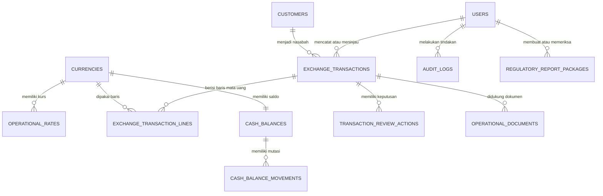

# Skema Database Proyek

**Sumber otoritatif skema:** `drizzle/schema.ts`.  
**Platform:** MySQL/TiDB melalui Drizzle ORM.  
**Prinsip:** simpan data transaksi dan kontrol dalam tipe presisi desimal, pertahankan jejak perubahan penting, dan pisahkan data demo/historis dari alur produksi.

> Dokumen ini adalah peta teknis. Skema aplikasi memakai relasi logis lewat kolom ID dan indeks; perubahan struktur harus dibuat di `drizzle/schema.ts`, menghasilkan migrasi, lalu diterapkan secara terkontrol pada database yang benar.

## Domain Entitas

| Domain | Tabel | Tanggung jawab |
|---|---|---|
| Identitas dan akses | `users` | Username, hash sandi, peran, status akun, versi sesi, dan kewajiban ganti sandi. |
| Mata uang dan kurs | `currencies`, `rate_reference_snapshots`, `operational_rates`, `market_rate_observations`, `rate_volatility_alerts`, `rate_sync_configurations`, `rate_sync_runs` | Mata uang, referensi, kurs outlet berstatus, observasi pasar, alarm, dan riwayat sinkronisasi. |
| Nasabah dan bon | `customers`, `exchange_transactions`, `exchange_transaction_lines`, `exchange_transaction_denomination_entries`, `exchange_transaction_payment_denominations`, `operational_documents`, `transaction_review_actions` | KYC, header bon (bisa berisi banyak baris mata uang), rincian pecahan valuta per baris, rincian pecahan Rupiah sisi pembayaran tunai, dokumen S3, serta keputusan review yang tidak ditimpa. |
| Kas dan outlet | `cash_balances`, `cash_balance_movements`, `cash_denomination_balances`, `stock_opnames`, `daily_operational_checklists`, `bank_accounts`, `bank_account_movements` | Saldo per mata uang, mutasi, stok pecahan berjalan, opname fisik, checklist harian, dan saldo rekening bank perusahaan (IDR-only, migrasi `0025`). |
| Konfigurasi dan layanan | `operational_settings`, `service_requests`, `public_announcements`, `consumer_complaints`, `company_profile` | Ambang pengawasan, permintaan layanan, pengumuman, keluhan, dan identitas perusahaan (migrasi `0027`) — nama PT/dagang, izin usaha, base currency (seed untuk multi-tenant masa depan, belum dipakai di luar kolom ini). |
| Keuangan internal | `operational_expenses` (migrasi `0029`) | Log pengeluaran operasional sederhana (kategori, nominal, deskripsi) — append-only, sepenuhnya terpisah dari `exchange_transactions`/`cash_balances`/`bank_accounts`. |
| Audit dan pengawasan | `audit_logs`, `director_acknowledgements` | Jejak perubahan serta tugas Direksi mengetahui. |
| Pelaporan internal | `regulatory_report_packages`, `financial_statement_snapshots`, `regulatory_incident_reports` | Paket manual, snapshot B0002/B0003/B0004, dan register insidental. |

## Relasi Operasional Utama

## Kontrol Data Penting

| Kontrol | Implementasi skema | Konsekuensi operasi |
|---|---|---|
| Presisi uang | `decimal(24, 6)` untuk valuta/rate, `decimal(24, 2)` untuk Rupiah bon | Jangan mengonversi nilai uang menjadi `float`. |
| Snapshot bon | Nilai kurs dan KYC disalin ke `exchange_transactions` | Riwayat bon tetap dapat dibaca bila profil/kurs berubah. |
| Bon multi-mata uang | `exchange_transaction_lines` — satu baris per mata uang/harga per bon (mirip tabel di kertas kwitansi fisik). `exchange_transactions.currencyId`/`foreignAmount`/`rateSnapshot`/`operationalRateId`/`quoteUnitSnapshot` nullable dan hanya terisi pada bon lama (sebelum fitur ini); `rupiahAmount` di header tetap terisi sebagai total seluruh baris. | Bon baru selalu dibaca lewat `exchange_transaction_lines`; kode yang membaca bon lama tetap jalan lewat kolom header lama (tidak dimigrasikan). |
| Harga per pecahan | `exchange_transaction_denomination_entries.agreedRate` wajib diisi per baris pecahan (mis. USD 100-an vs USD 10-an boleh beda harga dalam satu baris mata uang); `exchange_transaction_lines.agreedRate`/`foreignAmount`/`rupiahAmount` adalah **hasil hitung** (rata-rata tertimbang/total) dari pecahan tsb, bukan input langsung. `operationalRateId`/`referenceRateSnapshot` di baris hanya pembanding opsional. | Mata uang tanpa kurs otomatis tetap bisa dipakai transaksi; harga sesungguhnya selalu bersumber dari pecahan. |
| Mata uang dunia | Tabel `currencies` tidak lagi dibatasi ke mata uang yang disinkronkan BI/JISDOR — staf bisa mendaftarkan mata uang apa pun (termasuk IDR) lewat pencarian ISO 4217 di form, yang memanggil `ensureCurrency` (idempotent, tidak menyentuh kurs) | GBP, IDR, atau mata uang lain otomatis tersedia begitu pernah dipilih sekali; tidak perlu menunggu Admin membuatnya lebih dulu di Kurs Operasional. |
| Nomor kwitansi fisik | `exchange_transactions.receiptNumber` + unique index `(operation, receiptNumber)` | Bon Jual dan Bon Beli punya urutan nomor terpisah (No. 1 boleh ada di keduanya); `transactionNumber` sistem tetap ada terpisah untuk audit. |
| Stok pecahan berjalan | `cash_denomination_balances` (unik per `currencyId`+`denominationValue`) diperbarui otomatis oleh kas awal (reset ke hitungan yang dideklarasikan), penyesuaian, dan bon yang **diselesaikan** (bukan sekadar disetujui) — lihat `resetDenominationBalances`/`applyDenominationBalanceDelta` di `server/operations.ts` | "Stok pecahan saat ini" di Kas & Persediaan selalu mencerminkan kondisi sebenarnya tanpa perlu menjumlah ulang seluruh riwayat mutasi. |
| Validasi stok sebelum jual | `createTransaction` menolak bon JUAL bila `cashBalances`/`cashDenominationBalances` mata uang tsb tidak mencukupi kebutuhan seluruh baris (dicek terhadap saldo saat ini, bukan draft lain yang belum selesai) | Tidak bisa membuat bon jual untuk mata uang yang belum (atau belum selesai) dibeli; pembelian dan penjualan mata uang yang sama di hari yang sama tetap bisa asalkan pembelian **diselesaikan** dulu. |
| Dua sisi transaksi tunai | `exchange_transaction_payment_denominations` menyimpan rincian pecahan Rupiah sisi pembayaran (wajib diisi bila `paymentMethod` CASH, direkonsiliasi terhadap `rupiahAmount` total bon). Saat bon **diselesaikan**, sisi ini diposting ke `cashBalances`/`cashDenominationBalances` untuk mata uang IDR dengan arah **berlawanan** dari sisi valuta asing (BELI: Rupiah keluar, valuta asing masuk; JUAL: Rupiah masuk, valuta asing keluar). | Stok Rupiah ikut berubah pada setiap bon tunai, bukan hanya stok valuta asing; bon BELI ditolak di `createTransaction` bila stok Rupiah tidak cukup untuk membayar nasabah. Transfer bank/lainnya tidak menyentuh stok fisik sama sekali. |
| Pecahan wajib di semua pergerakan kas | `recordOpeningCash`/`recordCashAdjustment` menolak permintaan tanpa `denominations` (tidak lagi opsional) | Kas awal dan penyesuaian brankas/off-hours selalu punya rincian pecahan; stok pecahan berjalan tidak pernah "bolong" karena input opsional yang dilewati. |
| Auto-isi & tukar pecahan | `suggestDenominationBreakdown` mengusulkan kombinasi pecahan nyata dari `cash_denomination_balances` saat ini (bounded knapsack, tidak pernah melebihi stok); bila komposisi belum pas, `suggestDenominationExchange`/`recordDenominationExchange` mencatat pertukaran pecahan senilai sama persis (mis. 1×100.000 → 1×50.000+2×20.000+2×5.000) lewat kategori baru `cash_balance_movements.category = 'DENOMINATION_EXCHANGE'` (migrasi `0024`) | `cashBalances.availableAmount` tidak pernah berubah oleh pertukaran (nilai total sama); hanya komposisi `cash_denomination_balances` yang bergerak, tetap tercatat sebagai dua movement (OUT lalu IN) beserta audit log, bukan tulisan senyap ke stok. |
| Rekening bank perusahaan | Tabel baru `bank_accounts` (saldo berjalan per rekening, IDR-only) dan `bank_account_movements` (OPENING/TRANSACTION/ADJUSTMENT); `exchange_transactions.bankAccountId` (migrasi `0025`) menyimpan rekening yang dipakai saat `paymentMethod = 'BANK_TRANSFER'`, wajib diisi untuk metode tsb | Saldo rekening bergerak otomatis saat bon Transfer Bank **diselesaikan**, arah sama seperti sisi Rupiah kas (BELI keluar, JUAL masuk) — lihat `completeTransaction` di `server/operations.ts`. Bon lama sebelum fitur ini punya `bankAccountId = NULL` dan tidak diposting ulang. |
| Perubahan data nasabah beralasan | `updateCustomer` mewajibkan `changeReason` (≥5 karakter) di setiap panggilan, ditulis ke `audit_logs` beserta before/after state lengkap | Tidak ada jalur mengubah profil KYC tanpa jejak alasan; `hasBeneficialOwner`/`beneficialOwnerCustomerId` sengaja tidak ikut diedit di jalur ini (tetap ditentukan saat pembuatan profil). |
| Rupiah bukan baris transaksi | `createTransaction` menolak `line.currencyId` yang resolve ke kode `IDR` (migrasi tidak diperlukan — validasi murni di kode) | Rupiah hanya boleh muncul sebagai sisi pembayaran (`paymentDenominations`/`bankAccountId`), tidak pernah sebagai baris `exchange_transaction_lines`. |
| Rekening lawan transaksi | `exchange_transactions.counterpartyBankName`/`counterpartyAccountNumber`/`counterpartyAccountHolderName`/`counterpartyNameMismatchReason` (migrasi `0026`), wajib diisi bersamaan saat `paymentMethod = 'BANK_TRANSFER'` | Berbeda dari `bankAccountId` (rekening **kita**): kolom ini mencatat rekening **lawan** (tujuan saat BELI, pengirim saat JUAL). Bila nama pemilik rekening lawan berbeda dari nama nasabah, `counterpartyNameMismatchReason` wajib diisi dan otomatis tercetak di kwitansi (`printBon`). |
| Ambang underlying otomatis | `exchange_transactions.thresholdReason` (migrasi `0028`) — `createTransaction` memaksa `underlyingRequired = true` begitu nilai setara USD (kurs referensi BI) mencapai 10.000, walau kotak centang tidak dicentang manual; `thresholdReason` wajib diisi saat itu, terpisah dari `underlyingNotes` | Underlying kini terdiri dari tiga dokumen wajib (`operational_documents.documentType`: `UNDERLYING_FORM`/`UNDERLYING_STATEMENT`/`UNDERLYING_INVOICE`, migrasi `0028`) — `submitTransaction` menolak pengiriman bon sampai ketiganya tersimpan. `UNDERLYING` (tunggal) dipertahankan hanya untuk bon lama, tidak dipakai lagi untuk bon baru. |
| TKM (Transaksi Keuangan Mencurigakan) | `exchange_transactions.isSuspiciousTransaction`/`suspiciousIndicators` (json array kode, lihat `shared/suspiciousTransactionIndicators.ts`)/`suspiciousNotes` (migrasi `0028`) | Internal-only — sengaja **tidak pernah** dibaca oleh `printBon` atau ekspor CSV manapun (larangan *tipping-off* PPATK); menandai TKM otomatis men-set `requiresReview = true` terlepas dari ambang lain. Minimal satu indikator kurasi wajib dipilih, divalidasi ulang di server (bukan hanya client). |
| Pihak kuasa/wakil | `exchange_transactions.representativeCustomerId` merujuk nasabah terdaftar; `representativeName`/`representativeIdentityNumber` adalah snapshot otomatis dari nasabah tsb | Kuasa/wakil (termasuk BO) wajib didaftarkan sebagai nasabah sebelum dipilih di bon; tidak ada lagi input nama/identitas bebas. |
| Rincian pecahan | `exchange_transaction_denomination_entries` menyimpan nilai pecahan × jumlah lembar/keping per baris bon (`transactionLineId`), wajib rekonsiliasi dengan nominal valuta baris tsb bila diisi | Data pecahan tersedia untuk pelaporan stok fisik; tidak dicetak di kwitansi (kertas fisik hanya menampilkan ringkasan per baris). |
| Ekspor SIPESAT (PPATK) | `company_profile.sipesatIdPjk` (migrasi `0030`) + `shared/sipesatExport.ts` (`buildSipesatCsv`, penamaan file `IN`/`TW`) dipanggil dari `getSipesatExport` (`server/operations.ts`) | Membangun CSV untuk diunggah manual di sipesat.ppatk.go.id — tidak pernah mengirim data otomatis. Cakupan mengikuti Peraturan Kepala PPATK Nomor PER-02/1.02/PPATK/02/2014: **Data Initial** = seluruh nasabah live termasuk yang sudah ditutup (Pasal 13); **Data Triwulan** = hanya nasabah **baru** yang `createdAt`-nya jatuh pada periode terpilih (Pasal 12b) — bukan `updatedAt`, karena regulasi meminta "penambahan Pengguna Jasa baru", bukan nasabah lama yang datanya diedit. Kolom `No.NPWP` selalu kosong walau Pasal 7 mewajibkannya untuk Korporasi, karena `customers` belum membedakan individu/korporasi atau menyimpan NPWP per nasabah — diisi manual sebelum unggah bila perlu. |
| Rekap keuangan transaksi | `getTransactionRecap` (`server/operations.ts`) menghitung volume/turnover dan **estimasi** margin kotor per mata uang dari transaksi `COMPLETED` saja, murni di memori dari hasil `getTransactionReport` — tidak ada tabel/kolom baru | Margin dihitung metode rata-rata tertimbang (kurs jual rata² − kurs beli rata²) × volume yang cocok (`min` beli/jual); **bukan** FIFO cost-basis penuh karena sistem tidak melacak lot pembelian mana yang terjual. Selalu dilabeli "estimasi" di UI (`Reports.tsx`), jangan dijadikan angka final laporan keuangan resmi. |
| Data latihan | Flag `isDemo` pada transaksi, nasabah, kurs, dan opname | Query produksi wajib mengecualikan data demo. |
| Data historis | Flag `isHistorical` dan `historicalSourceKey` | Catatan impor tidak dapat dipakai sebagai transaksi hidup. |
| Dokumen | Hanya metadata dan `storageKey` di `operational_documents` | Bytes dokumen berada di object storage, bukan kolom database. |
| Dokumen profil perusahaan | `operational_documents.ownerType = 'COMPANY'` (`documentType`: `COMPANY_LOGO`/`LICENSE_CERTIFICATE`/`LICENSE_ATTACHMENT`), tanpa `customerId`/`transactionId`; upload dibatasi Controller ke atas (dicek di `server/_core/index.ts`, bukan hanya di client) | `company_profile.logoDocumentId` menunjuk salah satu dokumen `COMPANY_LOGO`; sertifikat/lampiran bisa lebih dari satu file per jenis. |
| Pencatatan pengeluaran | `operational_expenses` (migrasi `0029`) — `expenseDate`, `category` (enum kurasi di `shared/expenseCategories.ts`), `amount`, `description`, `notes`, `recordedByUserId`; bukti pengeluaran opsional via `operational_documents.ownerType = 'EXPENSE'` + `expenseId` (`documentType = 'EXPENSE_RECEIPT'`) | Entri **append-only** (tidak ada endpoint update/delete) — koreksi memakai entri baru, bukan edit. Tidak pernah menyentuh `exchange_transactions`/`cash_balances`/`cash_denomination_balances`/`bank_accounts`. |
| Audit | `audit_logs` memakai before/after state JSON | Jangan menghapus bukti untuk memperbaiki tampilan. |
| Sesi | `sessionVersion` pada `users` | Reset sandi, perubahan peran/status mencabut sesi lama. |

## Status Workflow Utama

| Objek | Status yang tersedia | Catatan |
|---|---|---|
| Bon | `DRAFT`, `PENDING_REVIEW`, `APPROVED`, `COMPLETED`, `RETURNED`, `CANCELLED` | Hanya bon hidup `COMPLETED` dipakai LKU internal. |
| Stock opname | `OPEN`, `SUBMITTED`, `RECONCILED`, `VARIANCE` | Varians harus terlihat untuk review. |
| Paket pelaporan | `DRAFT`, `PREPARED`, `RETURNED`, `APPROVED`, `EXPORTED` | `EXPORTED` bukan bukti pengiriman regulator. |
| Insidental | `DRAFT`, `PREPARED`, `APPROVED`, `EXPORTED` | Kewajiban lapor tetap keputusan manusia. |
| Keluhan | `OPEN`, `IN_REVIEW`, `RESOLVED`, `ESCALATED_LAPS_BI` | Hasil penyelesaian perlu narasi dan penanggung jawab. |

## Prosedur Perubahan Skema

1. Ubah `drizzle/schema.ts` dan perbarui/ tulis test yang relevan.
2. Jalankan generator migrasi sesuai konfigurasi proyek, lalu **baca** SQL migrasi sebelum menerapkannya.
3. Terapkan migrasi hanya sekali pada lingkungan yang benar, setelah backup dan pemeriksaan dependensi.
4. Verifikasi tabel/indeks baru dengan query baca-saja.
5. Jalankan `pnpm test`, `pnpm check`, dan `pnpm build` sebelum rilis.

Jangan menjatuhkan tabel, menghapus audit, atau mengubah tipe nominal pada lingkungan produksi tanpa rencana rollback dan persetujuan perusahaan.
