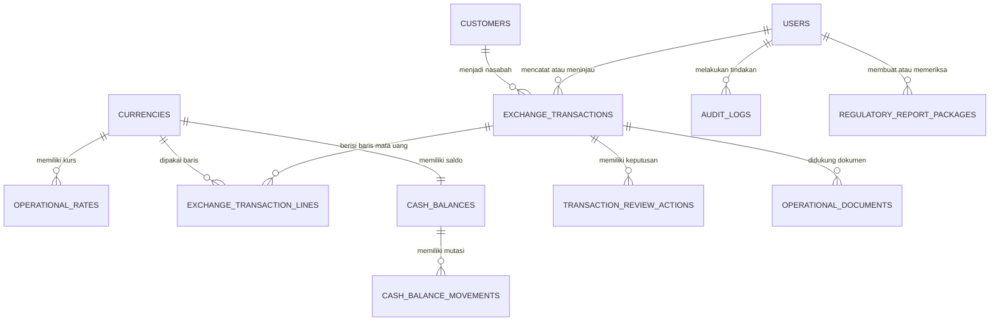

# Skema Database Proyek

**Sumber otoritatif skema:** `drizzle/schema.ts`.  
**Platform:** MySQL/TiDB melalui Drizzle ORM.  
**Prinsip:** simpan data transaksi dan kontrol dalam tipe presisi desimal, pertahankan jejak perubahan penting, dan pisahkan data demo/historis dari alur produksi.

> Dokumen ini adalah peta teknis. Skema aplikasi memakai relasi logis lewat kolom ID dan indeks; perubahan struktur harus dibuat di `drizzle/schema.ts`, menghasilkan migrasi, lalu diterapkan secara terkontrol pada database yang benar.

## Domain Entitas

| Domain | Tabel | Tanggung jawab |
|---|---|---|
| Identitas dan akses | `users` | Username, hash sandi, peran, status akun, versi sesi, dan kewajiban ganti sandi. |
| Mata uang dan kurs | `currencies`, `rate_reference_snapshots`, `operational_rates`, `market_rate_observations`, `rate_volatility_alerts`, `rate_sync_configurations`, `rate_sync_runs` | Mata uang, referensi, kurs outlet berstatus, observasi pasar, alarm, dan riwayat sinkronisasi. |
| Nasabah dan bon | `customers`, `exchange_transactions`, `exchange_transaction_lines`, `exchange_transaction_denomination_entries`, `exchange_transaction_payment_denominations`, `operational_documents`, `transaction_review_actions` | KYC, header bon (bisa berisi banyak baris mata uang), rincian pecahan valuta per baris, rincian pecahan Rupiah sisi pembayaran tunai, dokumen S3, serta keputusan review yang tidak ditimpa. |
| Kas dan outlet | `cash_balances`, `cash_balance_movements`, `cash_denomination_balances`, `stock_opnames`, `stock_opname_denominations`, `daily_operational_checklists`, `bank_accounts`, `bank_account_movements` | Saldo per mata uang, mutasi, stok pecahan berjalan, opname fisik beserta rincian pecahannya per lokasi (migrasi `0045`/`0046`), checklist harian, dan saldo rekening bank perusahaan (IDR-only, migrasi `0025`). |
| Konfigurasi dan layanan | `operational_settings`, `service_requests`, `public_announcements`, `consumer_complaints`, `company_profile` | Ambang pengawasan, permintaan layanan, pengumuman, keluhan, dan identitas perusahaan (migrasi `0027`) — nama PT/dagang, izin usaha, base currency (seed untuk multi-tenant masa depan, belum dipakai di luar kolom ini). |
| Keuangan internal | `operational_expenses` (migrasi `0029`) | Log pengeluaran operasional sederhana (kategori, nominal, deskripsi) — append-only, sepenuhnya terpisah dari `exchange_transactions`/`cash_balances`/`bank_accounts`. |
| Buku besar | `chart_of_accounts`, `accounting_periods`, `journal_entries`, `journal_entry_lines`, `period_closing_valuations` | Pembukuan berpasangan sebagai dasar tiap pos laporan keuangan (migrasi `0043`). Bagan akunnya di `shared/chartOfAccounts.ts`, aritmetika dan aturannya di `shared/ledger.ts`, operasinya di `server/ledgerOperations.ts`. Penilaian persediaan akhir UKA dan penutupan periode pada `server/periodClosing.ts` (migrasi `0047`). |
| Aset tetap | `fixed_assets`, `fixed_asset_depreciation_entries`, `fixed_asset_settings` | Register aset tetap, beban penyusutan bulanan yang benar-benar dijurnal, dan batas kapitalisasi (migrasi `0048`). Jadwal garis lurusnya murni di `shared/depreciation.ts`, pemetaan jurnalnya di `shared/journalMapping.ts`, operasinya di `server/fixedAssets.ts`. Memberi baris Penyusutan pada B0003 sebuah asal. |
| Kas valuta asing | `currency_revaluations` | Bukti retranslasi pos moneter valuta asing pada kurs penutup tiap akhir periode (migrasi `0049`). Aritmetikanya di `shared/currencyRevaluation.ts`, operasinya di `server/currencyRevaluation.ts`. Menghidupkan `REVALUASI_KURS`, akun 7-1500, dan akun 1-1220 yang sebelumnya disediakan tanpa satu pun penulis. |
| Kepegawaian dan kompetensi | `employees`, `employee_certifications`, `employee_pic_assignments`, `sdm_competency_plans`, `apu_training_sessions`, `apu_training_attendance`, `employee_profile_reviews`, `employee_candidates` | Pegawai dan jenjangnya, sertifikat kompetensi SP, penunjukan penanggung jawab fungsi, rencana/realisasi kompetensi triwulanan, pelatihan APU PPT beserta daftar hadir, peninjauan berkala profil pegawai (migrasi `0041`), dan penyaringan calon pegawai (migrasi `0042`). |
| Audit dan pengawasan | `audit_logs`, `director_acknowledgements` | Jejak perubahan serta tugas Direksi mengetahui. |
| Pelaporan internal | `regulatory_report_packages`, `financial_statement_snapshots`, `regulatory_incident_reports` | Paket manual, snapshot B0002/B0003/B0004, dan register insidental. Snapshot dapat berasal dari impor berkas luar atau dari buku besar sendiri lewat ekspor form (`sourceLabel` membedakannya: `"Buku besar"` untuk yang bersumber buku besar). **Struktur ketiga form B bukan tabel** — ia konstanta pada `shared/regulatoryForms.ts`, ditinjau sekali seperti bagan akun; paket G tidak menambah tabel maupun migrasi. |

## Relasi Operasional Utama

```mermaid
erDiagram
  USERS ||--o{ EXCHANGE_TRANSACTIONS : "mencatat atau meninjau"
  CUSTOMERS ||--o{ EXCHANGE_TRANSACTIONS : "menjadi nasabah"
  CURRENCIES ||--o{ OPERATIONAL_RATES : "memiliki kurs"
  EXCHANGE_TRANSACTIONS ||--o{ EXCHANGE_TRANSACTION_LINES : "berisi baris mata uang"
  CURRENCIES ||--o{ EXCHANGE_TRANSACTION_LINES : "dipakai baris"
  CURRENCIES ||--|| CASH_BALANCES : "memiliki saldo"
  CASH_BALANCES ||--o{ CASH_BALANCE_MOVEMENTS : "memiliki mutasi"
  EXCHANGE_TRANSACTIONS ||--o{ TRANSACTION_REVIEW_ACTIONS : "memiliki keputusan"
  EXCHANGE_TRANSACTIONS ||--o{ OPERATIONAL_DOCUMENTS : "didukung dokumen"
  USERS ||--o{ AUDIT_LOGS : "melakukan tindakan"
  USERS ||--o{ REGULATORY_REPORT_PACKAGES : "membuat atau memeriksa"
```

## Kontrol Data Penting

| Kontrol | Implementasi skema | Konsekuensi operasi |
|---|---|---|
| Presisi uang | `decimal(24, 6)` untuk valuta/rate, `decimal(24, 2)` untuk Rupiah bon | Jangan mengonversi nilai uang menjadi `float`. |
| Snapshot bon | Nilai kurs dan KYC disalin ke `exchange_transactions` | Riwayat bon tetap dapat dibaca bila profil/kurs berubah. |
| Bon multi-mata uang | `exchange_transaction_lines` — satu baris per mata uang/harga per bon (mirip tabel di kertas kwitansi fisik). `exchange_transactions.currencyId`/`foreignAmount`/`rateSnapshot`/`operationalRateId`/`quoteUnitSnapshot` nullable dan hanya terisi pada bon lama (sebelum fitur ini); `rupiahAmount` di header tetap terisi sebagai total seluruh baris. | Bon baru selalu dibaca lewat `exchange_transaction_lines`; kode yang membaca bon lama tetap jalan lewat kolom header lama (tidak dimigrasikan). |
| Harga per pecahan | `exchange_transaction_denomination_entries.agreedRate` wajib diisi per baris pecahan (mis. USD 100-an vs USD 10-an boleh beda harga dalam satu baris mata uang); `exchange_transaction_lines.agreedRate`/`foreignAmount`/`rupiahAmount` adalah **hasil hitung** (rata-rata tertimbang/total) dari pecahan tsb, bukan input langsung. `operationalRateId`/`referenceRateSnapshot` di baris hanya pembanding opsional. | Mata uang tanpa kurs otomatis tetap bisa dipakai transaksi; harga sesungguhnya selalu bersumber dari pecahan. |
| Mata uang dunia | Tabel `currencies` tidak lagi dibatasi ke mata uang yang disinkronkan BI/JISDOR — staf bisa mendaftarkan mata uang apa pun (termasuk IDR) lewat pencarian ISO 4217 di form, yang memanggil `ensureCurrency` (idempotent, tidak menyentuh kurs) | GBP, IDR, atau mata uang lain otomatis tersedia begitu pernah dipilih sekali; tidak perlu menunggu Admin membuatnya lebih dulu di Kurs Operasional. |
| Nomor kwitansi fisik | `exchange_transactions.receiptNumber` + unique index `(operation, receiptNumber)` | Bon Jual dan Bon Beli punya urutan nomor terpisah (No. 1 boleh ada di keduanya); `transactionNumber` sistem tetap ada terpisah untuk audit. |
| Stok pecahan berjalan | `cash_denomination_balances` (unik per `currencyId`+`denominationValue`) diperbarui otomatis oleh kas awal (reset ke hitungan yang dideklarasikan), penyesuaian, dan bon yang **diselesaikan** (bukan sekadar disetujui) — lihat `resetDenominationBalances`/`applyDenominationBalanceDelta` di `server/operations.ts` | "Stok pecahan saat ini" di Kas & Persediaan selalu mencerminkan kondisi sebenarnya tanpa perlu menjumlah ulang seluruh riwayat mutasi. |
| Validasi stok sebelum jual | `createTransaction` menolak bon JUAL bila `cashBalances`/`cashDenominationBalances` mata uang tsb tidak mencukupi kebutuhan seluruh baris (dicek terhadap saldo saat ini, bukan draft lain yang belum selesai) | Tidak bisa membuat bon jual untuk mata uang yang belum (atau belum selesai) dibeli; pembelian dan penjualan mata uang yang sama di hari yang sama tetap bisa asalkan pembelian **diselesaikan** dulu. |
| Dua sisi transaksi tunai | `exchange_transaction_payment_denominations` menyimpan rincian pecahan Rupiah sisi pembayaran (wajib diisi bila `paymentMethod` CASH, direkonsiliasi terhadap `rupiahAmount` total bon). Saat bon **diselesaikan**, sisi ini diposting ke `cashBalances`/`cashDenominationBalances` untuk mata uang IDR dengan arah **berlawanan** dari sisi valuta asing (BELI: Rupiah keluar, valuta asing masuk; JUAL: Rupiah masuk, valuta asing keluar). | Stok Rupiah ikut berubah pada setiap bon tunai, bukan hanya stok valuta asing; bon BELI ditolak di `createTransaction` bila stok Rupiah tidak cukup untuk membayar nasabah. Transfer bank/lainnya tidak menyentuh stok fisik sama sekali. |
| Pecahan wajib di semua pergerakan kas | `recordOpeningCash`/`recordCashAdjustment` menolak permintaan tanpa `denominations` (tidak lagi opsional) | Kas awal dan penyesuaian brankas/off-hours selalu punya rincian pecahan; stok pecahan berjalan tidak pernah "bolong" karena input opsional yang dilewati. |
| Auto-isi & tukar pecahan | `suggestDenominationBreakdown` mengusulkan kombinasi pecahan nyata dari `cash_denomination_balances` saat ini (bounded knapsack, tidak pernah melebihi stok); bila komposisi belum pas, `suggestDenominationExchange`/`recordDenominationExchange` mencatat pertukaran pecahan senilai sama persis (mis. 1×100.000 → 1×50.000+2×20.000+2×5.000) lewat kategori baru `cash_balance_movements.category = 'DENOMINATION_EXCHANGE'` (migrasi `0024`) | `cashBalances.availableAmount` tidak pernah berubah oleh pertukaran (nilai total sama); hanya komposisi `cash_denomination_balances` yang bergerak, tetap tercatat sebagai dua movement (OUT lalu IN) beserta audit log, bukan tulisan senyap ke stok. |
| Rekening bank perusahaan | Tabel baru `bank_accounts` (saldo berjalan per rekening, IDR-only) dan `bank_account_movements` (OPENING/TRANSACTION/ADJUSTMENT, ditambah CAPITAL_INJECTION/CAPITAL_WITHDRAWAL/CASH_TRANSFER pada migrasi `0044`); `exchange_transactions.bankAccountId` (migrasi `0025`) menyimpan rekening yang dipakai saat `paymentMethod = 'BANK_TRANSFER'`, wajib diisi untuk metode tsb | Saldo rekening bergerak otomatis saat bon Transfer Bank **diselesaikan**, arah sama seperti sisi Rupiah kas (BELI keluar, JUAL masuk) — lihat `completeTransaction` di `server/operations.ts`. Bon lama sebelum fitur ini punya `bankAccountId = NULL` dan tidak diposting ulang. |
| Perubahan data nasabah beralasan | `updateCustomer` mewajibkan `changeReason` (≥5 karakter) di setiap panggilan, ditulis ke `audit_logs` beserta before/after state lengkap | Tidak ada jalur mengubah profil KYC tanpa jejak alasan; `hasBeneficialOwner`/`beneficialOwnerCustomerId` sengaja tidak ikut diedit di jalur ini (tetap ditentukan saat pembuatan profil). |
| Rupiah bukan baris transaksi | `createTransaction` menolak `line.currencyId` yang resolve ke kode `IDR` (migrasi tidak diperlukan — validasi murni di kode) | Rupiah hanya boleh muncul sebagai sisi pembayaran (`paymentDenominations`/`bankAccountId`), tidak pernah sebagai baris `exchange_transaction_lines`. |
| Rekening lawan transaksi | `exchange_transactions.counterpartyBankName`/`counterpartyAccountNumber`/`counterpartyAccountHolderName`/`counterpartyNameMismatchReason` (migrasi `0026`), wajib diisi bersamaan saat `paymentMethod = 'BANK_TRANSFER'` | Berbeda dari `bankAccountId` (rekening **kita**): kolom ini mencatat rekening **lawan** (tujuan saat BELI, pengirim saat JUAL). Bila nama pemilik rekening lawan berbeda dari nama nasabah, `counterpartyNameMismatchReason` wajib diisi dan otomatis tercetak di kwitansi (`printBon`). |
| Ambang underlying otomatis | `exchange_transactions.thresholdReason` (migrasi `0028`) — `createTransaction` memaksa `underlyingRequired = true` begitu nilai setara USD (kurs referensi BI) mencapai 10.000, walau kotak centang tidak dicentang manual; `thresholdReason` wajib diisi saat itu, terpisah dari `underlyingNotes` | Underlying kini terdiri dari tiga dokumen wajib (`operational_documents.documentType`: `UNDERLYING_FORM`/`UNDERLYING_STATEMENT`/`UNDERLYING_INVOICE`, migrasi `0028`) — `submitTransaction` menolak pengiriman bon sampai ketiganya tersimpan. `UNDERLYING` (tunggal) dipertahankan hanya untuk bon lama, tidak dipakai lagi untuk bon baru. |
| TKM (Transaksi Keuangan Mencurigakan) | `exchange_transactions.isSuspiciousTransaction`/`suspiciousIndicators` (json array kode, lihat `shared/suspiciousTransactionIndicators.ts`)/`suspiciousNotes` (migrasi `0028`) | Internal-only — sengaja **tidak pernah** dibaca oleh `printBon` atau ekspor CSV manapun (larangan *tipping-off* PPATK); menandai TKM otomatis men-set `requiresReview = true` terlepas dari ambang lain. Minimal satu indikator kurasi wajib dipilih, divalidasi ulang di server (bukan hanya client). |
| Pihak kuasa/wakil | `exchange_transactions.representativeCustomerId` merujuk nasabah terdaftar; `representativeName`/`representativeIdentityNumber` adalah snapshot otomatis dari nasabah tsb | Kuasa/wakil (termasuk BO) wajib didaftarkan sebagai nasabah sebelum dipilih di bon; tidak ada lagi input nama/identitas bebas. |
| Rincian pecahan | `exchange_transaction_denomination_entries` menyimpan nilai pecahan × jumlah lembar/keping per baris bon (`transactionLineId`), wajib rekonsiliasi dengan nominal valuta baris tsb bila diisi | Data pecahan tersedia untuk pelaporan stok fisik; tidak dicetak di kwitansi (kertas fisik hanya menampilkan ringkasan per baris). |
| Ekspor SIPESAT (PPATK) | `company_profile.sipesatIdPjk` (migrasi `0030`) + `shared/sipesatExport.ts` (`buildSipesatCsv`, penamaan file `IN`/`TW`) dipanggil dari `getSipesatExport` (`server/operations.ts`) | Membangun CSV untuk diunggah manual di sipesat.ppatk.go.id — tidak pernah mengirim data otomatis. Cakupan mengikuti Peraturan Kepala PPATK Nomor PER-02/1.02/PPATK/02/2014: **Data Initial** = seluruh nasabah live termasuk yang sudah ditutup (Pasal 13); **Data Triwulan** = hanya nasabah **baru** yang `createdAt`-nya jatuh pada periode terpilih (Pasal 12b) — bukan `updatedAt`, karena regulasi meminta "penambahan Pengguna Jasa baru", bukan nasabah lama yang datanya diedit. Kolom `No.NPWP` selalu kosong walau Pasal 7 mewajibkannya untuk Korporasi, karena `customers` belum membedakan individu/korporasi atau menyimpan NPWP per nasabah — diisi manual sebelum unggah bila perlu. |
| Rekap keuangan transaksi | `getTransactionRecap` (`server/operations.ts`) menghitung volume/turnover dan **estimasi** margin kotor per mata uang dari transaksi `COMPLETED` saja, murni di memori dari hasil `getTransactionReport` — tidak ada tabel/kolom baru | Margin dihitung metode rata-rata tertimbang (kurs jual rata² − kurs beli rata²) × volume yang cocok (`min` beli/jual); **bukan** FIFO cost-basis penuh karena sistem tidak melacak lot pembelian mana yang terjual. Selalu dilabeli "estimasi" di UI (`Reports.tsx`), jangan dijadikan angka final laporan keuangan resmi. |
| Data latihan | Flag `isDemo` pada transaksi, nasabah, kurs, dan opname | Query produksi wajib mengecualikan data demo. |
| Data historis | Flag `isHistorical` dan `historicalSourceKey` | Catatan impor tidak dapat dipakai sebagai transaksi hidup. |
| Field KYC untuk pelaporan goAML | `customers.gender`, `nationality`, `addressType`/`addressCountry`/`addressProvince`/`addressCity`/`addressDistrict`/`addressPostalCode`, `npwp` (migrasi `0031`) | Memenuhi field wajib `t_person_my_client` skema XML goAML (gender, nationality1, residence, t_address, tax_reg_number). Wajib diisi untuk nasabah **baru** (`customerInput`/`customerUpdateInput`); nasabah lama tetap dapat dipakai dengan kolom ini `NULL` sampai dilengkapi lewat Edit (bon nasabah tsb dilewati saat ekspor goAML sampai dilengkapi). `last_name` goAML dipetakan dari `fullName` utuh (tanpa split first/last — konvensi umum untuk nama Indonesia yang sering satu kata); `source_of_wealth` goAML dipetakan dari `sourceOfFunds`. |
| Ekspor LTKT goAML (XML) | `company_profile.goamlRentityId`/`goamlReportingUserCode` (migrasi `0032`) + `shared/goAmlExport.ts` (pure XML builder, diverifikasi field-per-field terhadap `goAMLSchema.xsd`/`goAMLReportDataSchema.xsd`) dipanggil dari `getGoAmlLtktExport` (`server/operations.ts`) | Membangun XML untuk diunggah manual ke goAML — tidak pernah mengirim data otomatis. Cakupan sengaja sempit: hanya bon `paymentMethod='CASH'` berstatus `COMPLETED` yang memenuhi ambang LTKT (≥ Rp500 juta), dipetakan sebagai transaksi **Multiparty** (nasabah sebagai satu-satunya `party`, role `PJS`) — bukan Biparty, karena KUPVA sendiri adalah counterparty implisit (sesuai contoh eksplisit FAQ SIPENDAR). Arah: SELL→`LTKTM` (kas masuk), BUY→`LTKTK` (kas keluar), mengikuti arah kas Rupiah yang sudah dipakai `completeTransaction`. Satu `<transaction>` XML per baris mata uang bon (bukan per bon) dengan akhiran nomor transaksi `-L<n>`, karena `amount_local`/`foreign_currency` singular per `party`. Bon `BANK_TRANSFER` **tidak didukung** — butuh `t_account` (institution_code/SWIFT rekening lawan) yang belum dicatat sistem; ini gap yang didokumentasikan, bukan ditebak. Transaksi dengan profil nasabah belum lengkap (field goAML di atas) dilewati dan dilaporkan di `skipped`, bukan digagalkan seluruhnya atau ditebak. |
| Ekspor LTKM goAML (XML) | `shared/goAmlReportIndicators.ts` (197 kode `report_indicator_type` diekstrak verbatim dari `goAMLSchema.xsd`) + `buildGoAmlLtkmReportXml` (`shared/goAmlExport.ts`) dipanggil dari `getGoAmlLtkmExport` (`server/operations.ts`) | Struktur transaksi identik LTKT (Multiparty, `paymentMethod='CASH'`, `COMPLETED`), tapi kriteria seleksi memakai `exchangeTransactions.isSuspiciousTransaction = true` (bukan ambang Rp500 juta) dan **kedua** arah kas (BUY dan SELL) diikutsertakan — LTKM tidak dipisah per arah seperti LTKT. `report_indicator_type` adalah codebook goAML 197-kode yang **terpisah total** dari checklist TKM internal (`shared/suspiciousTransactionIndicators.ts`); tidak ada pemetaan otomatis yang dapat diandalkan, sehingga kode dipilih manual oleh pemeriksa lewat picker pencarian di UI saat ekspor (`server/routers.ts` memvalidasi tiap kode dengan `isKnownGoAmlReportIndicator` sebelum query berjalan). `report_code` yang dihasilkan selalu `LTKM` — varian `LTKMP`/`LTKMT` belum didukung. Elemen `<reason>` opsional (dari input `reason`) diselipkan sebelum `<transaction>`, `<report_indicators>` diselipkan setelahnya, sesuai urutan `xs:sequence` pada `goAMLSchema.xsd`. |
| Watchlist DTTOT/PPPSM | `sanctions_watchlist_entries` (migrasi `0033`) diisi lewat `parseSanctionsWatchlistWorkbook`/`importSanctionsWatchlist` (`server/sanctionsWatchlistImport.ts`, `server/operations.ts`); pencocokan nama fuzzy di `shared/sanctionsNameMatch.ts` (`searchSanctionsWatchlist`) | Data referensi publik PPATK/DK PBB (bukan data nasabah/transaksi), sehingga boleh disimpan di database meski aturan keras melarang menyuntikkan data produksi nyata. Dua bentuk workbook resmi dideteksi otomatis dari header, bukan dari nama file: DTTOT (satu sheet campuran Orang/Korporasi via kolom "Terduga"; alias tertanam di field Nama sendiri, dipisah dengan `splitAliasNames`) dan PPPSM (dua sheet Orang/Entitas per sub-daftar negara/rezim, kolom "Alias N"/"Alamat N" berjumlah variabel, baris pertama data adalah judul seksi yang dilewati). `sourceLabel` PPPSM diekstrak dari pola kode referensi (`DPRKi.001`→`DPRK`, `IRe.003`→`IR`) — bukan ditebak dari nama file — sehingga tiap sub-daftar (DPRK, Iran, dst.) dapat diperbarui independen: unggahan baru untuk satu `(listType, sourceLabel)` **mengganti seluruh** entri lama pada scope itu dalam satu transaksi, tidak pernah digabung/di-merge. Pencocokan nama memakai kesamaan token berbasis Levenshtein (bukan library NLP eksternal) dengan `MATCH_THRESHOLD=0.6`, murni **alat bantu penyaringan** — tidak pernah mengisi `customers.dttotPpsdmMatch` secara otomatis; petugas tetap memutuskan dan mencatat manual. Impor dibatasi Controller ke atas (endpoint REST `/api/sanctions-watchlist-import`, validasi ukuran/MIME/signature sama seperti impor snapshot keuangan); pencarian terbuka untuk Staff ke atas karena Staff yang membuat profil nasabah. |
| Pemadanan massal watchlist SIPENDAR | `checkSipendarWatchlistNames` (`server/operations.ts`) memakai `parseWatchlistNameList`/`scoreNameMatch` dari `shared/sanctionsNameMatch.ts` — **tidak ada tabel baru** | Sengaja tidak persisten dan tidak berbentuk importer XLSX/XML seperti DTTOT/PPPSM — layout kolom ekspor watchlist SIPENDAR dari portal PPATK belum diverifikasi terhadap contoh nyata (beda dengan DTTOT/PPPSM yang sudah diberi user), jadi dibuat sebagai tempel daftar nama polos (maks 500 nama/batch) yang dihitung sekali pakai lalu dibuang, bukan ditebak skemanya. Arah pencocokan kebalikan dari pencarian DTTOT/PPPSM: satu nama watchlist dicocokkan terhadap **seluruh** `customers` aktif (bukan satu nama dicari di satu daftar), sesuai kewajiban PPATK Peraturan Nomor 11 Tahun 2021 bahwa PJK memadankan tiap record watchlist ke seluruh basis data nasabah. Maksimal 10 kandidat nasabah per nama watchlist, diurutkan skor menurun. Sama seperti pencarian DTTOT/PPPSM, ini murni alat bantu — tidak pernah mengubah data nasabah atau memicu tindakan otomatis (lihat Pasal 19 Peraturan PPATK Nomor 11 Tahun 2021: kecocokan watchlist tidak serta-merta mewajibkan pemblokiran/pelaporan LTKM). |
| Nilai dan batas kolom `date` | `dateColumnBound` dan `jakartaBusinessDateColumn` (`server/operations.ts`) serta `dbDate` (`server/ledgerOperations.ts`) menormalkan tanggal menjadi tengah malam **waktu lokal proses** sebelum dikirim. Dijaga `server/businessDateColumn.test.ts`. | mysql2 memformat `Date` memakai zona waktu proses, jadi tengah malam UTC terkirim sebagai `'2026-09-01 07:00:00'` di GMT+7 — `eq()` tidak pernah cocok dengan baris yang sudah ada (pencarian checklist/opname hari berjalan gagal menemukan barisnya sendiri lalu menabrak kunci unik), dan `gte()` menyingkirkan baris yang jatuh tepat pada batas bawahnya. Benar di produksi yang berjalan UTC, salah hanya di mesin pengembangan WIB — karena itu bug jenis ini lolos tanpa suara dan sudah dua kali muncul kembali. Normalisasi dilakukan **sekali**; menerapkannya dua kali memundurkan tanggalnya satu hari, sehingga nilai yang sudah diserahkan ke fungsi yang menormalkan sendiri (mis. `insertJournal`) tidak boleh dibungkus lagi. Arah **baca** tidak perlu dinormalkan: kolom `date` kembali sebagai tengah malam UTC, jadi `toISOString().slice(0, 10)` sudah benar. Mengujinya menuntut asersi atas **jam lokal** hasilnya — di WIB bagian tanggalnya sama persis dan hanya jamnya yang berbeda. |
| Dokumen | Hanya metadata dan `storageKey` di `operational_documents` | Bytes dokumen berada di object storage, bukan kolom database. |
| Dokumen profil perusahaan | `operational_documents.ownerType = 'COMPANY'` (`documentType`: `COMPANY_LOGO`/`LICENSE_CERTIFICATE`/`LICENSE_ATTACHMENT`), tanpa `customerId`/`transactionId`; upload dibatasi Controller ke atas (dicek di `server/_core/index.ts`, bukan hanya di client) | `company_profile.logoDocumentId` menunjuk salah satu dokumen `COMPANY_LOGO`; sertifikat/lampiran bisa lebih dari satu file per jenis. |
| Pencatatan pengeluaran | `operational_expenses` (migrasi `0029`) — `expenseDate`, `category` (enum kurasi di `shared/expenseCategories.ts`), `amount`, `description`, `notes`, `recordedByUserId`; bukti pengeluaran opsional via `operational_documents.ownerType = 'EXPENSE'` + `expenseId` (`documentType = 'EXPENSE_RECEIPT'`) | Entri **append-only** (tidak ada endpoint update/delete) — koreksi memakai entri baru, bukan edit. Tidak pernah menyentuh `exchange_transactions`/`cash_balances`/`cash_denomination_balances`/`bank_accounts`. |
| Buku besar berpasangan | Empat tabel di atas (migrasi `0043`). `postJournalEntry` menolak jurnal yang debit ≠ kredit, berkaki tunggal, bernominal nol, memakai akun di luar `chart_of_accounts`, atau jatuh pada periode berstatus `DITUTUP`. Koreksi hanya lewat `reverseJournalEntry` — baris jurnal tidak pernah diubah maupun dihapus. Nominal dihitung sebagai bilangan bulat sen (`bigint`) di `shared/ledger.ts`, tidak pernah `number`. | Menjawab temuan pemeriksaan BI butir 7.1 ("tidak dapat menunjukkan buku besar sebagai dasar penyusunan masing-masing pos dalam laporan keuangan"): tiap akun terpetakan ke baris B0002/B0003/B0004, dan tiap pos dapat ditelusuri ke jurnal beserta rujukan sumbernya. Kunci unik `(sourceType, sourceReference)` membuat penjurnalan otomatis idempoten — dijalankan dua kali tidak menghasilkan jurnal ganda; jurnal manual mengisi `sourceReference` NULL sehingga tidak saling menghalangi. `branchId` disediakan sejak awal sebagai dimensi agar penambahan cabang tidak menulis ulang jurnal. Tanggal dikirim ke MySQL sebagai tengah malam **waktu lokal** hari yang dimaksud (`dbDate`); mengirim `Date` tengah malam UTC membuat pembanding `entryDate >= '...07:00:00'` menyingkirkan jurnal tanggal 1 dari laporan bulannya sendiri. Menutup periode ditolak bila ada jurnal tidak utuh — `verifyLedgerIntegrity` membandingkan jumlah baris tiap jurnal dengan total yang tersimpan pada kepalanya, sehingga baris yang disunting langsung lewat SQL tertangkap; membandingkan jumlah kedua sisi neraca saldo tidak akan pernah gagal dan hanya memberi rasa aman palsu. Neraca saldo menghitung saldo akhir secara **kumulatif** (saldo sebelum periode ditambah mutasi periode) untuk seluruh akun — menyaring saldo awal ke akun neraca saja membuat kedua sisinya berselisih persis sebesar laba periode sebelumnya, karena jurnal penutup belum dibangun. Belum ada penjurnalan otomatis dari transaksi/kas/pengeluaran — itu fase berikutnya, dan belum ada antarmukanya. |
| Penjurnalan otomatis ke buku besar | `shared/journalMapping.ts` (pemetaan murni, teruji) dipanggil `server/ledgerPosting.ts`; **tidak ada tabel baru** — idempotensinya bersandar pada kunci unik `(sourceType, sourceReference)` di `journal_entries`. | Dijalankan sebagai proses terpisah atas rentang tanggal pilihan pengguna, **bukan** disisipkan ke `completeTransaction`: penyelesaian bon memindahkan uang di meja kasir, dan kegagalan pembukuan tidak boleh menggagalkannya. Cakupan: bon `COMPLETED` non-demo/non-historis (`sourceReference` = `transactionNumber`) dan pengeluaran (`EXP-<id>`). Pemetaannya memakai **persediaan periodik** sesuai struktur B0003 — BELI → Dr 5-1200 Pembelian UKA, JUAL → Cr 4-1100 Penjualan UKA, sisi Rupiahnya ke 1-1110 (CASH) atau 1-1120 (BANK_TRANSFER); `paymentMethod = OTHER` dilewati dengan alasan, tidak ditebak. Akun 1-1210 Kas UKA baru bergerak pada akhir periode lewat persediaan akhir hasil opname, karena harga pokok per lot (FIFO/rata-rata) memang tidak dilacak sistem ini. Pengeluaran dikredit ke **2-1900 Kewajiban Lain-Lain**, bukan ke kas: modul pengeluaran sengaja tidak menyentuh `cash_balances`, sehingga mengkredit kas akan membuat buku besar berbeda dari stok kas — persis temuan 7.2/7.3. Mutasi kas dan bank ikut dijurnal lewat `postCashMovements`/`postBankMovements` (`sourceType` `MUTASI_KAS`/`MUTASI_BANK`, `sourceReference` = `KAS-<id>` / `BANK-<id>`); kategori yang tidak dapat dipetakan tanpa menebak dikembalikan sebagai `skipped` beserta alasan yang dapat dibaca manusia — lihat baris "Kategori mutasi kas dan bank" di bawah. |
| Kategori mutasi kas dan bank | `cash_balance_movements.category` (migrasi `0044`): `OPENING`, `TRANSACTION`, `SAFE_DEPOSIT`, `SAFE_WITHDRAWAL`, `OFF_HOURS_SALE`, `DENOMINATION_EXCHANGE`, `CAPITAL_INJECTION`, `CAPITAL_WITHDRAWAL`, `BANK_DEPOSIT`, `BANK_WITHDRAWAL`, `OTHER`. `bank_account_movements.category`: `OPENING`, `TRANSACTION`, `ADJUSTMENT`, `CAPITAL_INJECTION`, `CAPITAL_WITHDRAWAL`, `CASH_TRANSFER`, `OTHER`. Ditulis oleh `recordCapitalMovement`/`recordCashBankTransfer` (`server/operations.ts`, Controller ke atas), dipetakan oleh `mapCashMovement`/`mapBankMovement` (`shared/journalMapping.ts`). | Mutasi kas: `CAPITAL_INJECTION` → Dr 1-1110 Kas Rupiah, Cr 3-1100 Modal Disetor. `CAPITAL_WITHDRAWAL` → Dr 3-4100 Prive/Dividen, Cr 1-1110 — **bukan** pengurangan Modal Disetor, karena pengambilan pemilik adalah distribusi, bukan pembatalan setoran. `BANK_DEPOSIT` → Dr 1-1120 Bank, Cr 1-1110. `BANK_WITHDRAWAL` → Dr 1-1110, Cr 1-1120. `OPENING` dijurnal sebagai **selisih hitung kas** terhadap 7-1900 (naik → Dr 1-1110; turun → Cr 1-1110), kecuali kas awal **pertama** untuk mata uang itu yang bertambah: itu dilewati dengan alasan "asal uangnya belum tercatat — catat sebagai setoran modal lebih dulu", sebab menjurnalnya akan mencatat modal pemilik sebagai pendapatan lain-lain. `TRANSACTION` dilewati (sisi kas bon sudah terjurnal lewat bonnya, kalau tidak uangnya terhitung dua kali); `SAFE_DEPOSIT`/`SAFE_WITHDRAWAL` dilewati (laci↔brankas adalah kas yang sama, B0002 hanya punya satu baris Kas Rupiah); `DENOMINATION_EXCHANGE` dilewati (net nol); `OFF_HOURS_SALE` dilewati (nilai Rupiah lawannya tidak disimpan); `OTHER` dilewati (tidak dapat dipetakan tanpa menebak akunnya). Mutasi bank: `OPENING` dan `CAPITAL_INJECTION` → Dr 1-1120 Bank, Cr 3-1100 Modal Disetor (`OPENING` bank sengaja diperlakukan berbeda dari `OPENING` kas: saldo awal rekening memang uang yang disetorkan pemilik, bukan selisih hitung); `CAPITAL_WITHDRAWAL` → Dr 3-4100 Prive/Dividen, Cr 1-1120; `CASH_TRANSFER` dilewati karena sudah terjurnal dari sisi kas; `TRANSACTION`/`ADJUSTMENT`/`OTHER` dilewati. Hanya mata uang/rekening **IDR** yang dijurnal — valuta asing dinilai di akhir periode lewat persediaan periodik. Nominal mutasi berskala enam desimal; bila pecahannya di bawah sen, mutasi itu dilewati alih-alih dibulatkan diam-diam. Rincian pecahan tetap **wajib** untuk kedua tindakan, dan `recordCashBankTransfer` menulis kedua sisi (kas dan rekening) dalam satu transaksi. |
| Penyaringan calon pegawai | `employee_candidates` (migrasi `0042`) — tabel terpisah dari `employees`, dengan `screeningResult`/`screenedAt`/`screeningNotes` (penilaian manusia) dan `watchlistCheckedAt`/`watchlistMatchCount`/`watchlistSummary` (jejak pencocokan otomatis ke `sanctions_watchlist_entries` lewat `searchSanctionsWatchlist`); operasi di `server/sdmOperations.ts` (`listCandidates`/`recordCandidate`/`screenCandidate`/`decideCandidate`) | Calon disimpan pada tabelnya sendiri justru agar **calon yang tidak diterima tetap tersimpan** — kolom penyaringan pada `employees` hanya pernah terisi untuk yang diterima, sehingga tidak dapat membuktikan bahwa penyaringan benar-benar dijalankan (temuan pemeriksaan: perekrutan dari lingkungan keluarga tanpa penyaringan terdokumentasi). Tidak ada jalur hapus; `decideCandidate` menolak `DITERIMA` selama `screeningResult` belum `LULUS`, dan `screenCandidate` menolak hasil akhir tanpa keterangan. Kecocokan watchlist tidak pernah menentukan hasil — ia hanya jejak, dan diulang setiap penyaringan disimpan karena daftarnya dapat berubah. Menulis `EMPLOYEE_CANDIDATE_RECORDED`/`_SCREENED`/`_DECIDED` ke `audit_logs` tanpa memuat nama calon. |
| Opname per pecahan, laci dan brankas | `stock_opname_denominations` (migrasi `0045`; kolom `systemQuantity` pada `0046`) — satu baris per `(stockOpnameId, location, denominationValue)` dengan `location` ENUM `COUNTER`/`SAFE`, `quantity` (hasil hitung fisik), `systemQuantity` (jumlah menurut sistem **saat opname dikirim**), dan `subtotal`. Empat kolom baru pada `stock_opnames`: `physicalCounterBalance`, `physicalSafeBalance`, `closingSystemSafeBalance` (ketiganya nullable), dan `hasDenominationVariance` (default `false`). Angka pembandingnya disusun `getOpnameSystemCounts` (`server/operations.ts`), dibandingkan `compareDenominationCounts` (`shared/denominationVariance.ts`), dipakai `submitStockOpname`/`reconcileStockOpname` dan layar Stock Opname. | `submitStockOpname` tidak lagi menerima `physicalBalance`: nominalnya **dijumlahkan dari rincian pecahan** dua lokasi, sama seperti setiap jalur kas fisik lain. Daftar laci wajib tidak kosong; daftar brankas boleh kosong dan tetap dibandingkan dengan sistem — "dihitung dan memang kosong" berbeda dari "tidak dihitung", yang tidak ada lagi sebagai pilihan. Rincian wajib **tanpa cabang pengecualian `isHistorical`**: itu invarian ke depan, jadi importir opname historis kelak wajib membawa rinciannya. **`closingSystemBalance` tetap berarti laci saja** — arti kolom lama tidak digeser; brankas punya `closingSystemSafeBalance` sendiri, dan `variance = physicalBalance − (closingSystemBalance + COALESCE(closingSystemSafeBalance, 0))` sehingga baris lama (kolomnya NULL) beraritmetika persis seperti sebelumnya. Isi brankas **diturunkan, tidak disimpan**: `SAFE_DEPOSIT` dikurangi `SAFE_WITHDRAWAL` atas `cash_denomination_entries` tiap mutasi (`OFF_HOURS_SALE` tidak ikut — uang itu keluar dari laci karena terjual), logika yang sama dengan total pada `getCashReconciliation`, hanya dipecah per pecahan. Sisi laci dibaca dari `cash_denomination_balances` **tanpa penyaring `quantity > 0`** yang dipakai `listCashDenominationBalances`: pecahan yang nol di sistem tetapi ada di tangan petugas adalah temuan, bukan derau. Baris disimpan sebagai **gabungan kedua sisi**, sehingga pecahan yang ada menurut sistem tetapi tidak ditemukan tetap punya barisnya ("sistem 2, fisik 0") alih-alih menghilang. `systemQuantity` dibekukan saat pengiriman justru agar rincian varians tidak perlu disusun ulang terhadap stok berjalan yang sudah bergerak — ketergantungan yang `hasDenominationVariance` dibuat untuk dihindari. Selisih komposisi yang totalnya nol **tetap** `VARIANCE` dan wajib ditinjau Supervisor; butir "Direksi Mengetahui" menyebutkan pecahan mana yang meleset, karena "selisih 0.000000" yang berdiri sendiri justru menyesatkan. Opname tetap **tidak** menyentuh `cash_balances` dan selisihnya tidak dijurnal otomatis — menutupnya masih tindakan manusia lewat Penyesuaian Brankas. |
| Penilaian persediaan akhir UKA dan penutupan periode | `period_closing_valuations` (migrasi `0047`) — satu baris per `(periodId, currencyId)`, unik, berisi `quantity` beserta `stockOpnameId`/`opnameDate` yang membuktikannya, `buyRate`/`sellRate`/`quoteUnit` beserta `rateSnapshotId`/`rateReferenceDate` yang dipakai, `midRatePerUnit` (12 desimal) dan `rupiahValue` (2 desimal). Empat kolom baru pada `accounting_periods`: `valuationPostedAt`, `valuationJournalEntryId`, `profitClosingPostedAt`, `profitClosingJournalEntryId`. Aritmetikanya murni di `shared/inventoryValuation.ts`, pemetaan jurnalnya `mapPeriodInventoryClosing` dan `mapYearEndProfitClosing` di `shared/journalMapping.ts`, operasinya `server/periodClosing.ts`. | Jawaban temuan BI 7.1 pada tingkat baris: pos "Kas UKA" bukan angka yang muncul entah dari mana, melainkan hitungan fisik dikali kurs BI yang dapat ditunjuk — tiap baris dapat diturunkan ulang dari isinya sendiri. `opnameDate` dan `rateReferenceDate` **disimpan meski dapat dijangkau lewat id-nya**, karena keduanya boleh lebih awal daripada akhir periode (outlet hanya menghitung saat buka; BI tidak mengumumkan kurs pada hari libur) dan perbedaan itu harus terbaca tanpa menelusuri tabel lain. Penanda ditaruh sebagai **kolom pada `accounting_periods`, bukan disimpulkan dari ada-tidaknya baris penilaian**: outlet yang belum memegang UKA menghasilkan nol baris dan itu keadaan sah yang tetap harus dapat ditutup — menghitung baris akan mencampur "belum dinilai" dengan "sudah dinilai, hasilnya memang kosong". Persediaan periodik berarti **1-1210 Kas UKA hanya bergerak di sini**, sekali per periode: satu jurnal `TUTUP_PERIODE` bertanggal akhir periode dengan `sourceReference = TUTUP-{periodId}` memuat pembalikan nilai periode sebelumnya ke 5-1100 sekaligus pembukuan nilai baru ke 5-1300, sehingga tidak ada jurnal yang ditulis ke periode lain dan idempotensinya cukup dijaga kunci unik `(sourceType, sourceReference)` yang sudah ada. Selisih kursnya **melebur ke harga pokok** — memisahkannya ke 7-1500 menuntut harga perolehan per lot yang sistem ini tidak melacak, dan menebaknya di buku besar adalah persis yang temuan 7.1 larang. Jurnal penutup laba ke 3-2100 (`TUTUP-LABA-{tahun}`) **hanya pada periode yang berakhir 31 Desember**; konsekuensinya neraca memakai laba **sejak penutupan tahunan terakhir**, bukan sejak awal pembukuan (`server/financialStatements.ts`). `closeAccountingPeriod` menolak periode yang `valuationPostedAt`-nya kosong, dan periode Desember yang `profitClosingPostedAt`-nya kosong. **IDR tidak pernah ikut dinilai** — kas Rupiah sudah pada 1-1110, dan menilainya lagi pada 1-1210 menghitungnya dua kali sementara neracanya tetap seimbang, sehingga kekeliruannya tidak akan terlihat dari laporan mana pun. |
| Aset tetap dan penyusutan | Tiga tabel (migrasi `0048`). **`fixed_assets`** — `assetCode` (unik bila diisi, `fixed_assets_code_uq`), `name`, `category` (enum `fixedAssetCategories`: `TANAH`, `BANGUNAN`, `KENDARAAN`, `PERALATAN_KANTOR`, `PERANGKAT_KERAS`, `PERANGKAT_LUNAK`, `INVENTARIS_LAIN`), `taxGroup` (enum `fixedAssetTaxGroups`, nullable), `acquisitionDate`, `acquisitionCost`, `residualValue`, `usefulLifeMonths` (NULL = tidak disusutkan), `firstJournalMonth` `varchar(7)`, `openingAccumulatedDepreciation`, `acquisitionJournalEntryId` (NULL = aset warisan), `status` `AKTIF`/`DILEPAS`, `disposalDate`/`disposalProceeds`/`disposalJournalEntryId`/`disposalNotes`, `notes`, `recordedByUserId`; indeks `(status, acquisitionDate)` dan `(category)`. **`fixed_asset_depreciation_entries`** — `assetId`, `periodMonth` `varchar(7)`, `periodId`, `charge`, `accumulatedAfter`, `carryingAfter`, `journalEntryId`; unik `(assetId, periodMonth)` (`fixed_asset_depreciation_asset_month_uq`), indeks `(periodMonth)` dan `(periodId)`. **`fixed_asset_settings`** — satu baris `id = 1`, `capitalisationThresholdIdr` (default `1000000.00`), `updatedByUserId`. Dua kolom baru pada `accounting_periods`: `depreciationPostedAt` dan `depreciationJournalEntryId`. Dua nilai baru `journalSourceTypes`: `PEROLEHAN_ASET` dan `PELEPASAN_ASET`. | Menjawab temuan BI 7.1 pada baris Penyusutan B0003, yang sebelumnya tidak punya asal sama sekali: tiap beban dapat ditelusuri ke satu baris register beserta harga perolehan, tanggal, dan umur manfaat yang dipakai menghitungnya. `usefulLifeMonths` disimpan **terpisah** dari `taxGroup` karena kelompok DJP (PMK 72/2023) hanya mengisi nilai awalnya; SAK EP Bab 17 menuntut umur manfaat sebenarnya yang ditinjau tahunan, dan memasang aturan pajak diam-diam sebagai kebijakan akuntansi adalah kekeliruan yang menurun ke setiap pelanggan sekaligus. `firstJournalMonth` dan `openingAccumulatedDepreciation` melayani **aset warisan** dengan formula yang sama seperti aset baru — bulan perolehan tetap dibaca dari `acquisitionDate`, sehingga sisa umur manfaatnya benar dan asetnya berakhir tepat pada nilai residu; membaca bulan perolehan dari `firstJournalMonth` membagi sisa dasar penyusutan atas umur manfaat penuh dan asetnya tidak pernah habis disusutkan (uji regresinya di `server/monthlyDepreciation.test.ts`). `acquisitionJournalEntryId` NULL menandai aset warisan yang saldo 1-1510/1-1520-nya masuk lewat jalur `SALDO_AWAL`; register tidak boleh menjadi modul kedua yang menulis saldo awal. `fixed_asset_depreciation_entries` hanya memuat bulan yang jurnalnya **sudah ditulis**, bukan jadwal teoretis — pelepasan membaca akumulasi dari sini, karena mengeluarkan dari 1-1520 lebih banyak daripada yang pernah masuk membuat neraca tetap seimbang sementara angkanya salah. Penanda penyusutan ditaruh sebagai **kolom pada `accounting_periods`**, dengan alasan yang sama seperti `valuationPostedAt`: outlet tanpa aset tersusutkan menghasilkan nol baris beban, dan itu keadaan sah yang tetap harus dapat ditutup. `PEROLEHAN_ASET` dan `PELEPASAN_ASET` dipisahkan dari `PENYUSUTAN` karena paket F menyusun bagian **investasi** Arus Kas dengan mengenali kedua kejadian itu, dan `sourceType` adalah satu-satunya penanda yang tidak menebak. Modul ini **tidak pernah menyentuh sistem kas** — perolehan lewat 2-1900, pelepasan lewat 1-1320, pelunasannya dijurnal terpisah saat uangnya benar-benar bergerak. `capitalisationThresholdIdr` sengaja bukan kolom `operational_settings`: tabel itu dibaca `adminProcedure`, sementara batas ini menentukan apa yang masuk neraca dan apa yang masuk laba rugi — keputusan Controller. |
| Kas valuta asing dan revaluasi kurs | `currency_revaluations` (migrasi `0049`) — satu baris per `(periodId, currencyId)`, unik (`currency_revaluation_period_currency_uq`), berisi `foreignBalance` (24,6), `carryingBefore`, `rateSnapshotId`/`rateReferenceDate`/`midRatePerUnit` (30,12) sebagai bukti kursnya, `carryingAfter`, `difference`, dan `journalEntryId`; indeks `(periodId)`. Dua kolom baru pada `accounting_periods`: `revaluationPostedAt` dan `revaluationJournalEntryId`. Aritmetikanya murni di `shared/currencyRevaluation.ts` (`snapshotOnOrBefore`, `valueMonetaryBalance`, `CASH_ACCOUNTS`), memakai ulang `midClosingRate` paket C; pemetaan jurnalnya `mapCurrencyRevaluation`; operasinya `server/currencyRevaluation.ts`. | SAK EP Bab 30 menuntut pos moneter valuta asing diukur ulang pada kurs penutup tiap akhir periode dengan selisihnya ke laba rugi — hal yang tidak akan pernah dikerjakan orang yang mengisi formulir Excel, karena tidak ada baris B0002/B0003 yang memintanya. Sebelum paket ini `mapBankMovement` menolak rekening non-IDR dengan alasan *"rekening valuta asing belum dinilai"*, sehingga uang yang benar-benar ada tidak muncul pada laporan mana pun. Mutasinya kini dijurnal ke 1-1220 pada **kurs tanggal mutasi**, dan `journal_entry_lines.currencyCode`/`foreignAmount` — kolom yang sudah lama disediakan dengan keterangan "untuk penelusuran dan revaluasi" tetapi tidak pernah ada yang mengisi — akhirnya terisi pada baris itu. Saldo valuta **dan** nilai tercatat Rupiah karena itu dibaca dari baris jurnal yang **sama**: mengambil saldo dari `bank_account_movements` sementara Rupiahnya dari buku besar akan berselisih setiap kali ada mutasi yang dilewati karena kursnya belum tersedia, dan selisih palsu itu akan dijurnal sebagai laba/rugi kurs yang tidak pernah terjadi. Baris 1-1220 tanpa `currencyCode` adalah jurnal revaluasi itu sendiri — satu jurnal untuk seluruh mata uang — dan sengaja diabaikan pada penjumlahan mutasi supaya selisih yang sudah dijurnal tidak dihitung ulang; sukunya diambil dari `currency_revaluations`. **Hanya pos moneter yang diretranslasi:** 1-1210 Kas UKA adalah persediaan yang dinilai dari hitungan fisik lewat 5-1300 pada paket C, dan meretranslasinya juga menghitung pergerakan kurs yang sama dua kali sementara neracanya tetap seimbang. Penanda ditaruh sebagai kolom pada `accounting_periods` dengan alasan yang sama seperti `valuationPostedAt` dan `depreciationPostedAt`: outlet tanpa rekening valuta asing menghasilkan nol baris, dan itu keadaan sah yang tetap harus dapat ditutup. `closeAccountingPeriod` menolak periode yang `revaluationPostedAt`-nya kosong — urutan gerbangnya kini keutuhan jurnal → penyusutan → revaluasi kurs → penilaian persediaan → penutup laba Desember → kunci — dan `postYearEndProfitClosing` menuntut dua belas bulan revaluasi, karena penutup laba menolkan 7-1500. `CASH_ACCOUNTS` (`1-1110`, `1-1120`, `1-1220`) disediakan di sini untuk Arus Kas paket F2; 1-1210 sengaja tidak termasuk. |
| Pelunasan kewajiban, Arus Kas, dan CALK | Dua tabel dan dua nilai enum baru (migrasi `0050`). **`ledger_settlements`** — `settlementDate`, `direction` (`PEMBAYARAN`/`PENERIMAAN`), `targetType` (`BEBAN`/`ASET_TETAP`), `expenseId`/`fixedAssetId`, `amount`, `cashMovementId`/`bankMovementId` (masing-masing berindeks unik), `notes`, `createdByUserId`; indeks `(expenseId)`, `(fixedAssetId)`, `(settlementDate)`. **`financial_statement_notes`** — `noteKey` `varchar(60)`, `periodKey` `varchar(7)` **nullable**, `bodyText`, `updatedByUserId`; unik `(noteKey, periodKey)`. Dua nilai baru pada `cash_balance_movements.category` dan `bank_account_movements.category`: `KEWAJIBAN_DIBAYAR` dan `PIUTANG_DITERIMA`. Aritmetikanya murni di `shared/cashFlow.ts` (`classifyCashEntry`) dan daftar catatannya di `shared/financialNotes.ts`; penyusunnya `server/cashFlow.ts` dan `server/financialNotes.ts`; penulisnya `server/settlements.ts`. | Sampai paket F2, **tidak ada satu pun jurnal yang membayar beban atau aset dengan kas**: `mapExpense` dan `mapFixedAssetAcquisition` sama-sama mengkredit 2-1900, `mapFixedAssetDisposal` mendebit 1-1320, dan pelunasan yang dijanjikan komentar `mapExpense` tidak pernah ditulis. Akibatnya bagian operasi Arus Kas tidak akan pernah memuat pembayaran beban dan bagian investasinya kosong selamanya — fitur tanpa sumber data, yang menurut `CLAUDE.md` adalah pekerjaan yang belum selesai. Karena itu penulisnya masuk ke dalam paket yang sama. Pelunasan **tidak** memakai `sourceType` baru: ia memang mutasi kas, sehingga jalur `MUTASI_KAS`/`MUTASI_BANK` yang sudah ada yang menjurnalkannya, lengkap dengan idempotensi `KAS-{id}`/`BANK-{id}`. Kedua indeks unik pada `cashMovementId`/`bankMovementId` mencegah satu mutasi dihitung dua kali sebagai pelunasan (banyak NULL menembus indeks unik MySQL, jadi sisi yang tidak dipakai tidak saling menghalangi). `targetType` adalah **satu-satunya** penanda yang memisahkan bagian operasi dari bagian investasi: jurnal pelunasan beban dan pelunasan aset identik (Dr 2-1900 / Cr kas), dan akun lawannya tidak membedakan keduanya. Perolehan aset yang belum dilunasi karena itu **tidak pernah** muncul sebagai arus kas — ia diungkapkan pada catatan CALK "transaksi nonkas", tempat SAK EP memintanya. Klasifikasinya menolak menebak: jurnal `MANUAL`, jurnal `SALDO_AWAL`, dan jurnal yang akun lawannya jatuh ke lebih dari satu bagian masuk keranjang "belum terklasifikasi" yang terlihat beserta nomor jurnalnya, karena membagi arus kas menurut perkiraan berarti mengarang angka. `reconciled` membandingkan **dua jalur yang dihitung terpisah** — perubahan saldo `CASH_ACCOUNTS` dan jumlah klasifikasi tiap jurnal; menurunkan keduanya dari satu sumber akan membuat penandanya selalu benar dan karena itu tidak berguna. Pada `financial_statement_notes`, `periodKey` NULL berarti teks yang berlaku terus dan baris berperiode menang atasnya: kebijakan akuntansi tidak berganti tiap bulan, sedangkan peristiwa setelah periode pelaporan selalu berganti, dan laporan periode lampau harus tetap menampilkan teks yang berlaku baginya. Catatan bangkitan menolak diketik lewat `saveFinancialNoteText`, supaya angka CALK tidak pernah dapat berselisih dengan laporannya. |
| Audit | `audit_logs` memakai before/after state JSON | Jangan menghapus bukti untuk memperbaiki tampilan. |
| Sesi | `sessionVersion` pada `users` | Reset sandi, perubahan peran/status mencabut sesi lama. |

## Status Workflow Utama

| Objek | Status yang tersedia | Catatan |
|---|---|---|
| Bon | `DRAFT`, `PENDING_REVIEW`, `APPROVED`, `COMPLETED`, `RETURNED`, `CANCELLED` | Hanya bon hidup `COMPLETED` dipakai LKU internal. |
| Stock opname | `OPEN`, `SUBMITTED`, `RECONCILED`, `VARIANCE` | Varians harus terlihat untuk review. |
| Paket pelaporan | `DRAFT`, `PREPARED`, `RETURNED`, `APPROVED`, `EXPORTED` | `EXPORTED` bukan bukti pengiriman regulator. |
| Insidental | `DRAFT`, `PREPARED`, `APPROVED`, `EXPORTED` | Kewajiban lapor tetap keputusan manusia. |
| Keluhan | `OPEN`, `IN_REVIEW`, `RESOLVED`, `ESCALATED_LAPS_BI` | Hasil penyelesaian perlu narasi dan penanggung jawab. |
| Aset tetap | `AKTIF`, `DILEPAS` | Aset yang dilepas tidak pernah dihapus; `disposalDate`, hasil, dan jurnalnya tersimpan pada barisnya. |

## Prosedur Perubahan Skema

1. Ubah `drizzle/schema.ts` dan perbarui/ tulis test yang relevan.
2. Jalankan generator migrasi sesuai konfigurasi proyek, lalu **baca** SQL migrasi sebelum menerapkannya.
3. Terapkan migrasi hanya sekali pada lingkungan yang benar, setelah backup dan pemeriksaan dependensi.
4. Verifikasi tabel/indeks baru dengan query baca-saja.
5. Jalankan `pnpm test`, `pnpm check`, dan `pnpm build` sebelum rilis.

Jangan menjatuhkan tabel, menghapus audit, atau mengubah tipe nominal pada lingkungan produksi tanpa rencana rollback dan persetujuan perusahaan.
